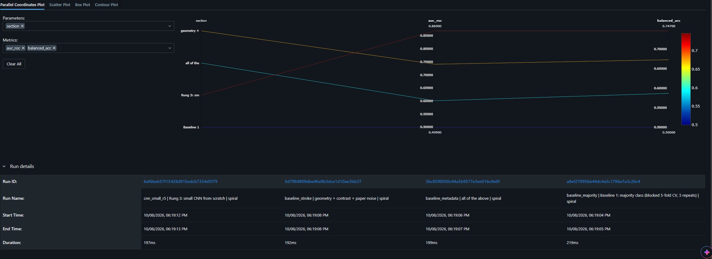

# parkinson-drawings-cv

Research/engineering project: classifying Parkinson's vs. healthy hand-drawn spirals and
waves with a baseline ladder, leakage-aware evaluation, Grad-CAM and ONNX export.

> **Not a medical device.** Educational/portfolio project. It makes no diagnostic claims.


> **Correction (2026-10-09): near-duplicate images leaked across the folds of the evaluation in this README, and the label may be readable from who or where a drawing came from.**
> An audit (`scripts/find_twins.py`, `reports/twins.md`) found that about 90% of the images have rotated or mirrored
> copies of the same drawing, roughly 8 per drawing: the 1,839 spirals are about 345-412 distinct drawings and the 1,382
> waves about 175-191. The blocked CV placed about 85% of those copy pairs in different folds. A baseline with no learning
> (copy the label of the most similar training image) reached AUC 0.94-0.96 in the background hold-out, which exposed it.
> Re-evaluated with copies kept together (`scripts/run_cluster_cv.py`; copies found on binarised and cropped drawings, so
> shifted and rescaled ones are linked too; intervals resample distinct drawings): stroke features 0.74 (spiral) / 0.71
> (wave); small CNN 0.84 / 0.80, close to its blocked-CV values (0.87 / 0.80); ImageNet-pretrained ResNet18 0.97 / 0.96.
> But the no-learning baseline, after cropping, reaches 0.88 / 0.93. A result that simple suggests the label can be read
> from the overall look of a drawing, which can reflect the disease but equally the person (the sources may contain
> several drawings per person) or the data source. The dataset has no subject or source IDs, so these cannot be
> separated, and none of the numbers should be read as accuracy on new patients.
## Status
Work in progress, MVP target: early November 2026. Done: data audit and cleaning, evaluation
protocol, baseline ladder up to a small CNN, a leakage/shortcut audit of the CNN, ONNX export with a
numerical-equivalence test and CPU latency, and MLflow tracking, plus a Gradio demo. Pending: transfer learning,
exploration notebook on the cleaned data.

## Setup
```bash
python -m venv .venv && source .venv/bin/activate   # Windows: .venv\Scripts\activate
pip install -r requirements.txt
```

## Data audit (Week 1)
The Kaggle *Parkinson YOLO Dataset* ships a train/val split that leaks: 35% of the validation
originals have an identical or near-identical twin in train, and 61 groups of identical
drawings carry both labels. After deduplication and dropping contradictory labels, **3,221
distinct drawings** remain (843 healthy spirals, 588 healthy waves, 996 parkinson spirals,
794 parkinson waves). Details and numbers: `docs/problem_statement.md`.

```bash
python scripts/inspect_yolo_dataset.py <dataset_root>   # layout, _augN leakage
python scripts/build_manifest.py <dataset_root>         # manifest of originals, number ranges
python scripts/check_near_duplicates.py                 # train vs val near-duplicates
python scripts/show_pairs.py                            # objective pair check + contact sheets
python scripts/build_clean_manifest.py                  # groups, conflicts, clean split
python scripts/audit_image_stats.py                     # image sizes, brightness, side-channel check
python scripts/run_baseline_majority.py                 # rung 1: majority-class floor
python scripts/run_baseline_metadata.py                 # rung 2a: metadata-only shortcut check
python scripts/extract_stroke_features.py               # stroke features per drawing
python scripts/run_baseline_stroke.py                   # rung 2b: stroke-feature logistic regression
python scripts/stroke_feature_importance.py             # which features separate the classes
python scripts/build_cnn_cache.py                        # 128px ink maps -> data/processed/cnn_cache_128.npz
python scripts/run_cnn.py data/processed/cnn_cache_128.npz   # rung 3: small CNN (~1.5 h on CPU for 5 repeats)
# audits of the CNN result (run_cnn.py first; each writes reports/*.md)
python scripts/run_cnn.py data/processed/cnn_cache_128.npz --repeats 1 --shuffle-labels --tag _shuffle
python scripts/run_cnn.py data/processed/cnn_cache_128.npz --repeats 1 --k 2 --tag _k2
python scripts/run_cnn.py data/processed/cnn_cache_128.npz --repeats 1 --crop 13 --tag _crop13
python scripts/run_baseline_stroke.py --k 2 --tag _k2   # same coarse blocks for the baseline
python scripts/check_cnn_neighbors.py data/processed/cnn_cache_128.npz
python scripts/check_cnn_background.py data/processed/cnn_cache_128.npz
python scripts/gradcam_cnn.py data/processed/cnn_cache_128.npz spiral   # also: wave
# final models, ONNX export and tracking (see "Export and tracking" below)
python scripts/train_final.py data/processed/cnn_cache_128.npz --mlflow
python scripts/predict_onnx.py <drawing.png> spiral
python scripts/log_reports_to_mlflow.py
pytest -q
```

## Evaluation protocol
Blocked stratified 5-fold CV over the deduplicated drawings (`src/parkinson_cv/splits.py`),
spiral and wave modelled separately, sensitivity/specificity/AUC with bootstrap CIs.

## Results so far
Blocked 5-fold CV (5 repeats) over the deduplicated drawings. Balanced accuracy / AUC-ROC;
95% bootstrap CIs are in `reports/*.md` (images are treated as independent, so the CIs are
optimistic).

| Rung | Model | Spiral | Wave | Pooled |
|---|---|---|---|---|
| 1 | Majority class (floor) | 0.500 / 0.499 | 0.500 / 0.499 | 0.500 / 0.499 |
| 2a | Logistic regression on metadata only (paper brightness, ink share, file size, alpha channel) | 0.587 / 0.601 | 0.555 / 0.588 | 0.590 / 0.625 |
| 2b | Logistic regression on stroke geometry (ink, thickness, crossings, spread) | 0.670 / 0.738 | 0.638 / 0.697 | 0.621 / 0.658 |
| 2b+ | ...plus ink contrast and paper noise | 0.673 / 0.741 | 0.664 / 0.748 | 0.613 / 0.673 |
| 3 | Small CNN from scratch (128 px paper-relative ink map, 20 epochs, light augmentation) | 0.747 / **0.869** | 0.711 / **0.804** | not run |

CNN, 95% CI of AUC-ROC: spiral 0.869 [0.851-0.883], wave 0.804 [0.783-0.827]; sensitivity/specificity
0.87/0.62 (spiral) and 0.84/0.58 (wave) at a fixed 0.5 threshold that was not tuned.
Reading: rung 2a uses nothing about the hand, yet it clearly beats the floor, so the data has a
weak side channel. Stroke features (2b) beat 2a by a wide margin (spiral AUC 0.74 vs 0.60), and
contrast + paper noise alone stay near chance, so the signal comes from the drawing. The
bar for image models is therefore about AUC 0.74 (spiral) and 0.75 (wave). Separate models per
drawing type beat one pooled model. The small CNN beats the best stroke-feature model by about
0.13 AUC on spirals and 0.06 on waves, with non-overlapping CIs; the five CV repeats agree with a
single repeat (spiral 0.867, wave 0.809), so the result does not depend on where the blocks are cut.

### Checks on the CNN result (is 0.87 real?)
A jump from 0.74 to 0.87 deserved suspicion, so it was tested before being trusted. Numbers are AUC-ROC
(spiral / wave), CNN trained with 1 repeat unless stated.

| Check | Result | What it says |
|---|---|---|
| Labels shuffled | 0.458 / 0.507 | Pipeline does not leak the label; chance level. |
| Coarse blocks (2 folds, half the training data) | CNN 0.811 / 0.796 vs stroke model 0.733 / 0.750 | CNN still wins, but loses more than the stroke model (0.056 on spirals), so part of the drop may be proximity in file numbering; not separable from the smaller training set. |
| Near-twins in other folds | AUC by similarity tercile low/mid/high: 0.865/0.834/0.899 (spiral), 0.878/0.817/0.806 (wave); only 1-2% of images have a neighbour with cosine similarity >= 0.95 | Gain does not come from near-duplicates (coarse 32 px measure; rotated or shifted copies would not be caught). |
| Outer 10% frame removed | 0.851 / 0.813 | Not dependent on the image border. |
| Background style (grey frame, paper grain) | CNN AUC inside every background tercile: 0.79-0.95 | Separates classes among images with similar backgrounds, so it is not only reading the background. |
| Grad-CAM (one held-out fold) | heat on stroke vs image: enrichment 1.22 (spiral), 0.97 (wave); 27% of the heat in the outer frame vs 36% if uniform | Spiral: mild preference for the stroke. Wave: no clear preference. The 8x8 map is coarse, so this is only an indication. |

Two things the checks did find. First, the background is not neutral: on waves the mean CNN
score falls from 0.82 to 0.48 across grey-frame terciles although the true parkinson rate stays
0.52-0.66, which produces false positives on clean white paper; this lowers rather than inflates the
pooled AUC (within-group AUC is higher than pooled). Second, the paper grain groups differ strongly in
class balance (parkinson rate 0.41 / 0.77 / 0.45 on spirals, 0.53 / 0.71 / 0.48 on waves), which is
compatible with different data sources, so a metadata-style signal exists in the data.

## Export and tracking
`scripts/train_final.py` trains one final CNN per drawing type on all usable drawings, exports it to
ONNX (dynamic batch) and checks that ONNX Runtime reproduces the PyTorch logits (max absolute difference,
same decisions on 64 real drawings plus a blank page). It also times single-image CPU inference for both
runtimes; results go to `reports/export.md`. These final models have no held-out evaluation: their expected
quality is the cross-validated result above. `scripts/predict_onnx.py` scores one image with ONNX Runtime
only (no PyTorch needed). Measured on the author's CPU: ONNX file 239 KB per model; max absolute
logit difference to PyTorch 3.8e-06 with identical decisions on 65 test inputs; single-image latency
(median of 200 runs) 0.27 ms with ONNX Runtime vs 1.7-1.9 ms with PyTorch. The preprocessing (`src/parkinson_cv/inkmap.py`) is shared by training and inference.

Experiments are tracked with MLflow. `scripts/log_reports_to_mlflow.py` logs the numbers already written in
`reports/*.md` (metrics and CI bounds, one run per table row) without re-training; browse them with
`mlflow ui --backend-store-uri sqlite:///mlflow.db` (if port 5000 is blocked on Windows, add `--port 5001`).

## Demo
`scripts/demo_gradio.py` is a small web app: upload a spiral or wave drawing, pick the type, and read the
model score. It runs the exported ONNX models on CPU (no PyTorch) with the same preprocessing as training
(`src/parkinson_cv/inference.py`). It needs `models/cnn_spiral.onnx` and `models/cnn_wave.onnx` from
`scripts/train_final.py`.

```bash
pip install gradio
python scripts/demo_gradio.py     # then open http://127.0.0.1:7860
```

Research prototype: not a medical device, no diagnosis. Use images that look like the dataset (cropped to the
stroke) and do not upload drawings of real people without permission. Each model only knows its own drawing type: a spiral scored with the wave model (or the reverse) gives a meaningless but often very confident score, so pick the type carefully.

## Data and attribution
The images are **not** included in this repository (`data/` is not versioned). They come from the Kaggle
*Parkinson Yolo Dataset* by CornelioAC (https://www.kaggle.com/datasets/cornelioac/parkinson-yolo-dataset),
declared by the publisher under CC BY 4.0. The publisher states that the data were compiled from other
sources (listed in `docs/DATA.md`). The code in this repository is under the MIT license (`LICENSE`).

## Held-out background groups
The blocked CV above still puts every background style on both sides of each split. As a harder check,
`scripts/run_group_holdout.py` cuts each drawing type into three groups by terciles of a background measure
(paper grain `speckle`, or grey-frame `frame_mean`), holds one group out and trains on the other two.
AUC-ROC inside the held-out groups, mean of the three (full tables with 95% CIs: `reports/group_holdout_*.md`):

| type | grouped by | small CNN | stroke features (best of 2) | background numbers only | CNN, blocked CV |
|---|---|---|---|---|---|
| spiral | speckle | 0.828 | 0.714 | 0.522 | 0.869 |
| spiral | frame_mean | 0.852 | 0.735 | 0.521 | 0.869 |
| wave | speckle | 0.787 | 0.693 | 0.560 | 0.804 |
| wave | frame_mean | 0.803 | 0.748 | 0.564 | 0.804 |

The CNN keeps most of its AUC when a whole background style is unseen and stays above the stroke-feature
baseline on average (spiral by about 0.11, wave by 0.05-0.09). For waves the margin is smaller, and in the
`frame_mean` high group the CNN is not distinguishable from stroke geometry (0.779 vs 0.811, overlapping
intervals). The background numbers alone are not always at chance inside a group (0.38 to 0.62 depending on the
group, with an unstable sign), but they stay far below the CNN. These runs train on 2/3 of the data instead of
4/5, which alone lowers AUC, so the drop is an upper bound of the effect of the shift. Groups are a crude
stand-in for "a new source", there is one CNN seed, and the intervals treat images as independent: this is not
evidence of generalisation to new patients.

## Limitations & ethics
- No subject identifiers: a subject-level split cannot be proven; blocked folds are only a
  proxy, so results are probably optimistic and say nothing about unseen patients.
- Deduplication catches byte-identical and near-identical files, not rotated/cropped copies.
- The data are a compilation of four upstream sources with different acquisition conditions. The publisher declares CC BY 4.0, but the upstream licenses and the overlap between sources were not checked (see `docs/DATA.md`).
- Small effective sample size; wide confidence intervals, especially for healthy waves.
- The drawings appear to be cropped to their bounding box and resized to 512x512 by the dataset
  authors (the ink spans ~98% of the frame in every class), so absolute size and aspect ratio,
  e.g. micrographia, cannot be measured.
- Shortcut learning was checked (table above) but cannot be excluded: the background groups differ
  in class balance, and the checks use crude, three-level background measures. Grad-CAM on waves
  does not show a clear focus on the stroke.
- The CNN's operating threshold (0.5) was not tuned; balanced accuracy is for reference, AUC is
  the main metric. The CNN was only run per drawing type, not pooled.
- Confidence intervals treat images as independent and the models were trained once per fold.
- Not a diagnostic tool and not clinically validated.



Spiral drawings, blocked 5-fold CV, point estimates (AUC-ROC, balanced accuracy): majority class, metadata, stroke features and the small CNN. Confidence intervals are in the results table above.

